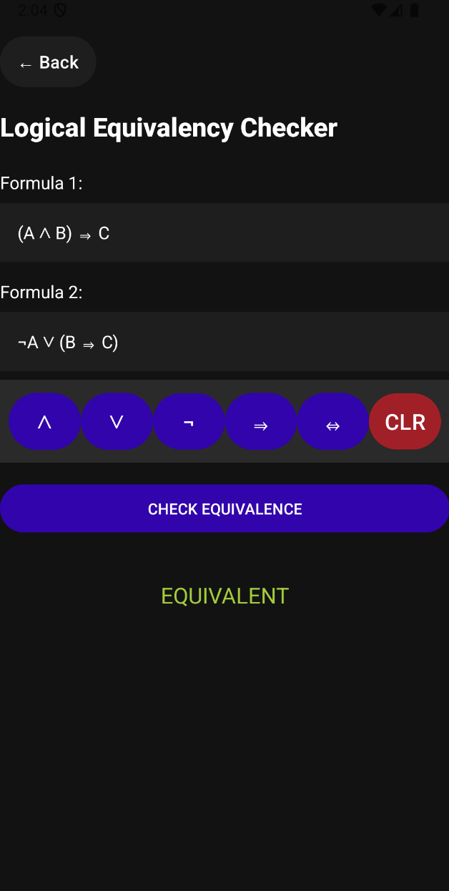

## About The Project

Numeralis is a native Android application that extends the capabilities of a traditional calculator by integrating advanced features from logic and selected areas of mathematics. It offers users a computational tool specifically tailored for complex logical operations.

## Features

### Mathematics Section
- **Arithmetic**: Perform basic arithmetic operations.
- **Base Conversion**: Convert numbers between numeral systems.
- **Bitwise Calculator**: Perform bitwise operations (AND, OR, XOR) on binary numbers.

### Logic Section
- **Logical Equivalency**: Test if two logical expressions are logically equivalent.
- **Logic Expression Converter**: Convert logical expressions to different formats (Arithmetic, CNF, DNF).
- **Satisfiability**: Determine if a given logical expression is satisfiable.
- **Truth Table**: Generate a truth table for a given logical expression.
- 
## How to Use

Upon launching the app, you'll be greeted with the main menu where you can choose from various operations.  


### Example Operations:

Here are just a few examples of the operations available in the app:

### 1. **Arithmetic Calculator**  
Tap on "Arithmetic" to access basic arithmetic functions. This uses standard mathematical notation for the operations.  


### 2. **Logical Equivalency**  
Navigate to "Logical Equivalency" to analyze logical equivalences. This uses standard logical notation for the operations, which you can find on the in-app keyboard.  


### 3. **Truth Table**  
Select "Truth Table" to generate truth tables for logical expressions. This uses standard logical notation for the operations, which you can find on the in-app keyboard.  


## Prerequisites

Before running or building the Numeralis app, ensure the following tools and software are installed:

- **Android Studio** (Recommended for development)
  - Ensure you have Android Studio set up with the necessary SDKs.
- **Java Development Kit (JDK) 8 or higher**
  - The app is developed using Java, so you’ll need a JDK installed on your machine.
- **Gradle**
  - The build system for this project is Gradle, which should be included with Android Studio.

Additionally, ensure you have an Android device or emulator for testing the app.

## Usage 

Follow these steps to set up and run the project:

1. **Clone the repository**
```bash
git clone https://github.com/Dio1000/UMLGenerator.git
```

2. **Navigate into the project directory**
```bash
cd UMLGenerator
```

3. **Open the project in Android Studio (this assumes Android Studio is installed)**

4. **Build and run the project on an emulator or connected device**
```bash
./gradlew build
./gradlew installDebug
```

## Contact

Darian Sandru - sandru.darian@gmail.com

Project Link: [https://github.com/Dio1000/UMLGenerator](https://github.com/Dio1000/UMLGenerator)

